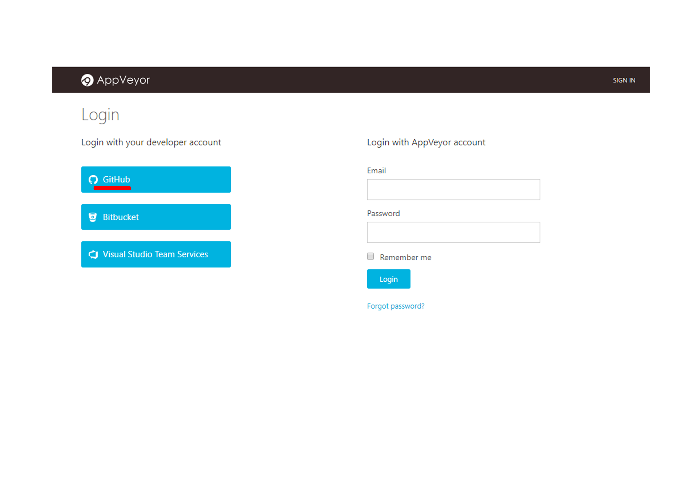
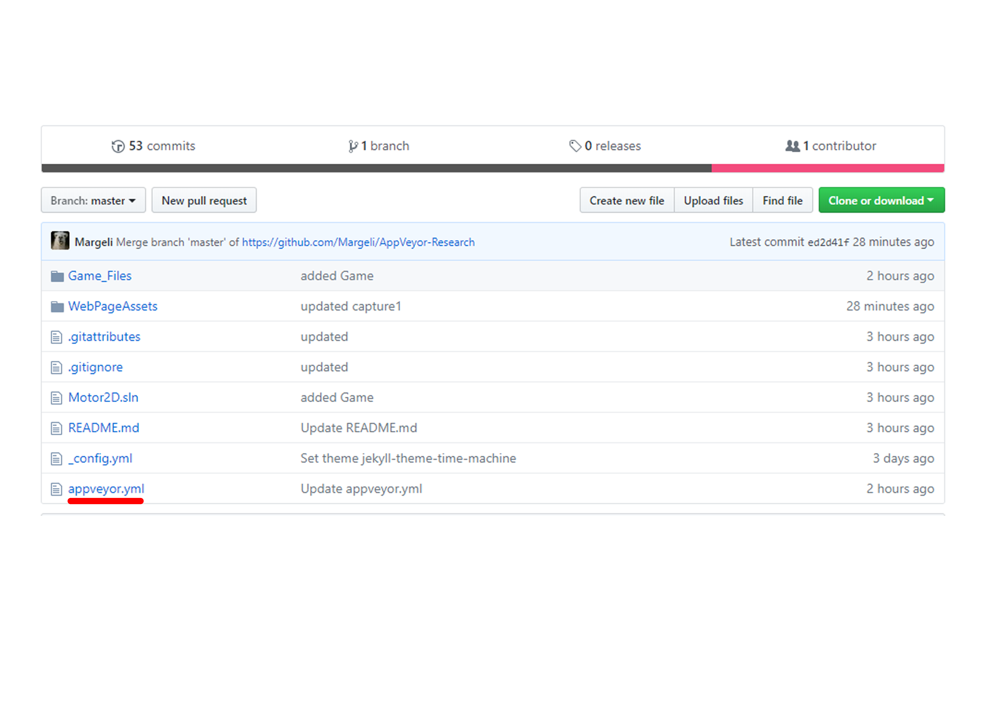
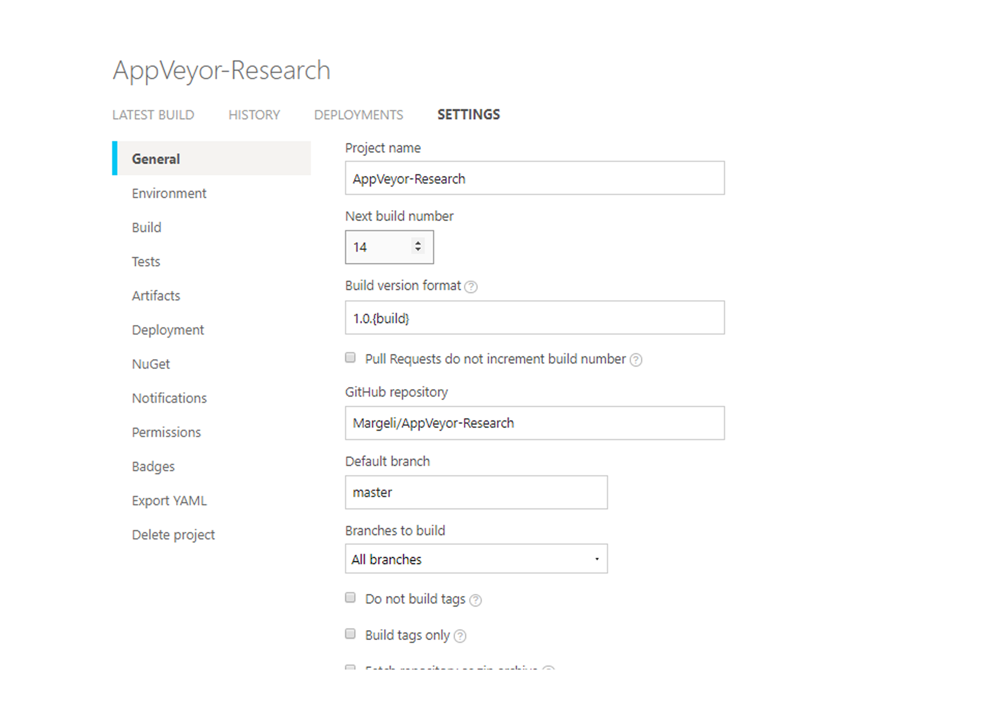
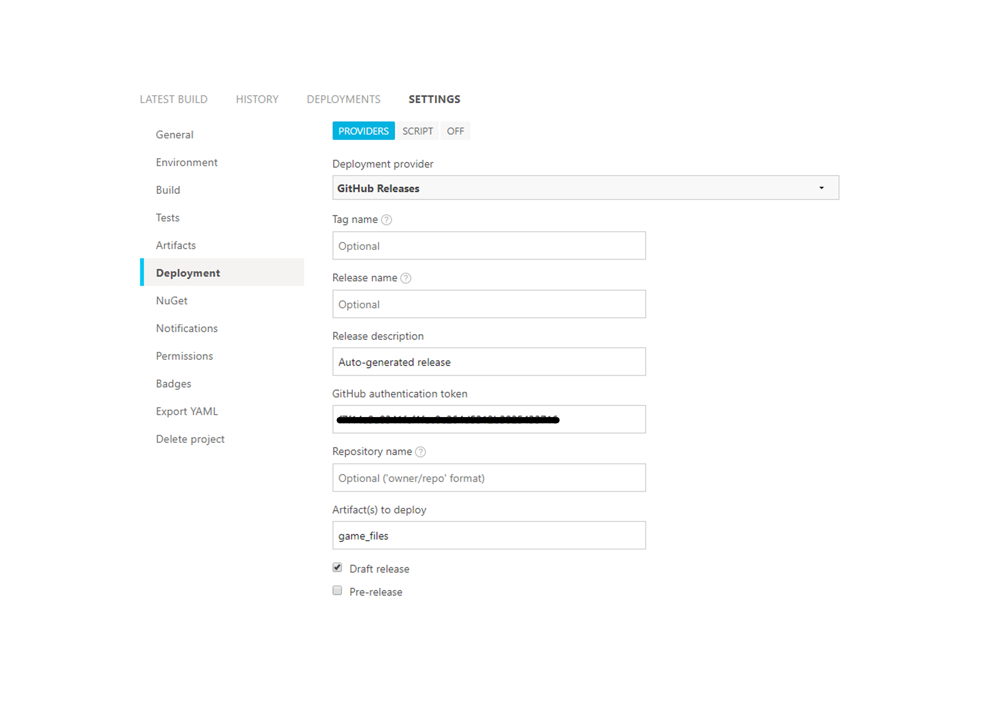
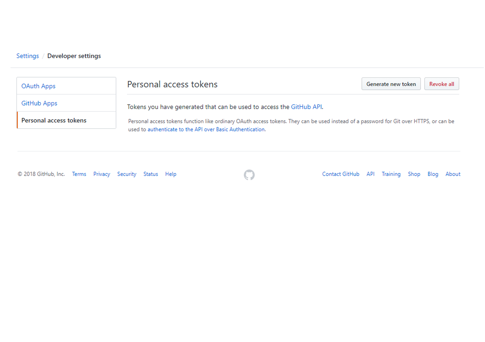
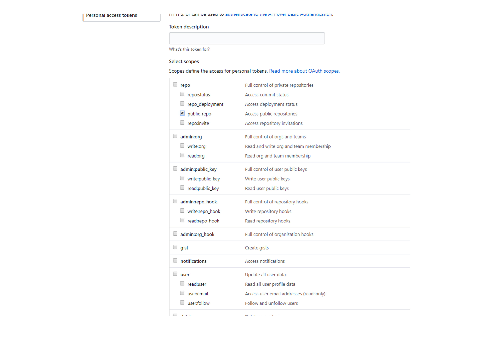
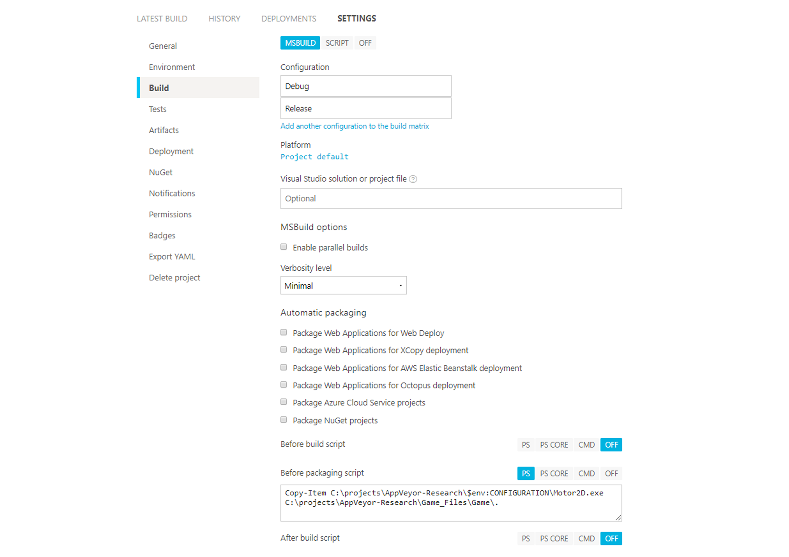
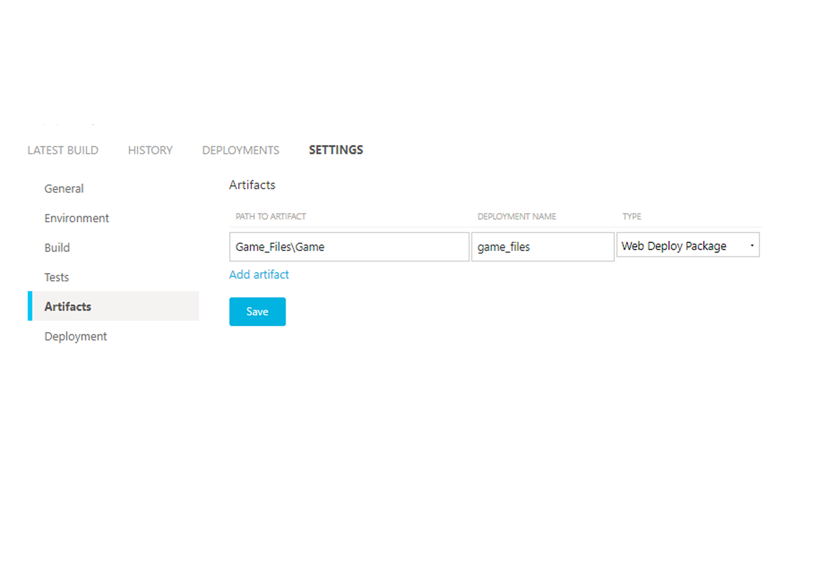

“I am [Carles Margelí](https://www.linkedin.com/in/carles-margel%C3%AD-549ab415a/), student of the [Bachelor’s Degree in Video Games by UPC at CITM](https://www.citm.upc.edu/cat/). This content is generated for the second year’s subject Project 2, under supervision of lecturer [Ricard Pillosu](https://www.linkedin.com/in/ricardpillosu/).”

In this article we will talk about how to avoid making builts manually in GitHub everytime a Release is made to be tested.
So, our objective, is to have an automated process that every time a commit in our code is done, a built of it is published in our repository in GitHub, including all the needed files.
To achieve it, we will be using an external application, AppVeyor. 
Following this guide step by step we will understand how AppVeyor works and how to configure it to obtain our desired results. 

I recommend this guide of [How AppVeyor works](https://www.appveyor.com/docs/enterprise/how-to/how-appveyor-works/) to understand the internal processes that it does. Even it is not necessary to understand the process we will make in this article.

# Let's start with the Tutorial:


## Starting with AppVeyor
   ● To begin with, we will need to create an account on AppVeyor using our GitHub account.

   ● Then, we will need to authorize it. If the GitHub repository to apply it is from an organization, it will require the authorization of the organization's owner. So it’s recommended to be done by the owner himself.
  
   

   ● Once we have synchronized both applications, we can go on with AppVeyor creating a new project and selecting the GitHub repository which we want to have automated builds. 

   ● Now we have our project in AppVeyor, by default every time we make a commit, it will try make a built, but it probably fail due to the app configuration is not the correct. So the next step is how to configure it. 
 
 
## Configuring AppVeyor

First of all you need to know that there are two ways to configure an AppVeyor project. 
The first one it is found in the project itself, in the Settings section; there, there is an interface to help you configure the whole project. 

 
 
 The second one is creating in your Github repository a YAML file named _appveyor.yml_ where is found the same configuration but in YAML format.
 
 
 
 I highly recommend first of all configure your project from AppVeyor project, in the settings, and then export this changes into an _appveyor.yml_ and added into your GitHub repository. So you can change any setting from the repository. 

It’s needed to remark that **AppVeyor will give preference to the YAML file before the project settings**. So be careful on that. 

[Here](https://www.appveyor.com/docs/build-configuration/) you can check the full documentation of all the possible settings that the project has.

But in this article we will focus on the basic settings to complete our objective, that is automated builds.
The project settings is divided in different sections, the main one is _General_. There, the most relevant option is that you can configure the build version format, that will increase every time a built is done (regardless of if it fails). Another useful setting is that you can select from which branch you want to make the built every time a commit is done. 



The next important setting is found in Environment where you have to select which Visual Studio version are you using.


Another relevant option is that one that upload the build done to our GitHub releases page. 
It is found in _Deployment_  and is need to change the deployment provider to GitHub Releases. It is recommended to add a Release description and mark the Draft Release to avoid having all the releases you made there. But before all of that is needed an authentication from GitHub to let AppVeyor modify our repository. It is done through a GitHub authentication token. 



We will make a parenthesis to show how to get it:

### How to get your GitHub authentication token

First of all, it’s important to say that an authentication token is like a password, so manage them like that. The difference is that it is used for scripts or commands, in a addition you can revoke them and generate lots of them. 
So, to generate one of them you need to go [Here](https://github.com/settings/tokens) or manually going to your GitHub, and go to _Settings_ (the general settings, not the repository ones). There is a section _Developer Settings_ with a subsection _Personal Access Tokens_.



There you need to _Generate a new token_ and just select the scope _public_repo_  and then Generate it.



Once done the token has to be copied to [Here](https://ci.appveyor.com/tools/encrypt) to encrypt the token, the result is an encrypted token that has to be copied to the _GitHub authentication token_ in the _Deployment_ setting that we were talking before.

## Back to AppVeyor

At this point AppVeyor is capable to access to the Release GitHub page. 

So our objective is to make AppVeyor do automated builds from our GitHub repository, but we need to remind which items a build should have:
- A README.md file
- A folder with all the Assets of the game and the libraries .dll
- The executable of the game .exe

I recommend to put together in a folder the ReadMe, the assets and the libraries to make the process easily. In all the explanation we will refer to this folder as _\Game_.

So we need to upload this _Game_ folder together with the executable of the game, that will be given by AppVeyor once it has made the Release. To do it we need to go again to the project _Settings_. 
Firstly we need to go to _Build_ section and fill the _Configuration_ option with Debug and Release.  We put both to check that there’s no problem compiling the code in Debug nor Release mode. Then, as we said before, we need to get the executable given after the AppVeyor does the Release to our code. So in _Before packaging script_ we need to insert a script in PS (_PowerShell_) language which will copy this executable to the _Game_ folder, to have all together. 

The script is the following:
```ruby
Copy-Item C:\projects\(your_project_name)\$env:CONFIGURATION\(your_solution_name).exe C:\projects\(your_project_name)\Game\.
```
_"Where the directory to copy is the solution of your Debug/Release, and the directory to paste it is your Game carpet"_

_"($env:CONFIGURATION): refers to Debug or Release folder"_

Below we have an example 



So now, after it is done the Release to our code, the folder _Game_ will contain all that a correct built needs. So the last step is to upload this folder to our GitHub Release page.
It is configured in the section _Artifacts_ where we need to put the path to the folder _Game_, with a name for the release and selected the _Web Deploy Package_ type.



If the steps are followed correctly the build should be upload to Release page as a draft every time a commit is done in the project. I recommend, as we said before, to export all the configuration to YAML format and upload to the repository to allow the modification directly from GitHub.


Another useful feature that AppVeyor provides is Notification, every time a built is done it will notificate through the channels that you prefer, the most common are Email, Slack.. There, you can select when it has to notificates you. Whether the built has been upload succesfully or it failed, or both. 


### Links to more documentation
[Official AppVeyor Tutorial](https://www.appveyor.com/docs/)

[Documentation of the configuration of AppVeyor](https://www.appveyor.com/docs/build-configuration/)

[How AppVeyor works](https://www.appveyor.com/docs/enterprise/how-to/how-appveyor-works/)

